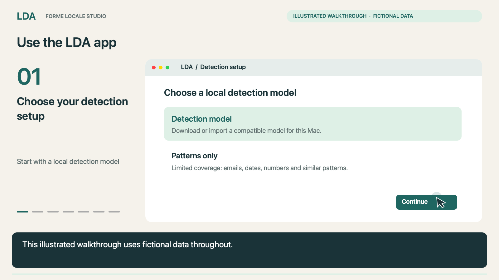
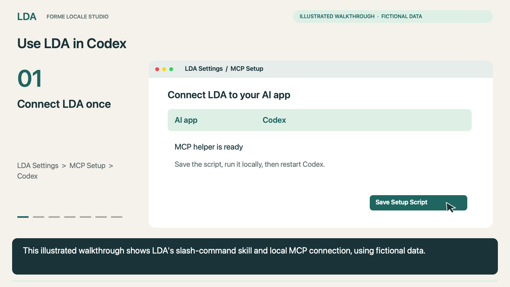

# LDA setup and video walkthroughs

Two illustrated walkthroughs, generated on a Mac Mini using fictional data. They are silent, with English subtitles embedded in the picture. No personal desktop, account, conversation, document or notification footage is included. Controls are simplified illustrations, and exact labels can vary by version.

## Use the LDA app (1:30)

[](https://github.com/Reytian/LDA-App/releases/download/tutorials-20260909/lda-app-walkthrough.mp4)

[Watch or download the video](https://github.com/Reytian/LDA-App/releases/download/tutorials-20260909/lda-app-walkthrough.mp4) · [Read the transcript](tutorials/lda-app-walkthrough.md) · [Download captions](tutorials/lda-app-walkthrough.vtt)

1. Open LDA, review and accept the Terms of Service and Privacy Policy, then choose or import a compatible local detection model. Patterns only has limited coverage and does not detect names, companies or addresses.
2. In Anonymize, add a document and choose **Scan for PII**.
3. Review the findings and protect anything missed. Check **Safe Preview**.
4. Choose **Export for AI**. Send only the reviewed, redacted version to your AI app. Ask it to preserve placeholders exactly.
5. Save the edited result and open **Restore** in LDA. Use the matching local mapping, review the output, and save it.

## Use LDA in Codex (1:57)

[](https://github.com/Reytian/LDA-App/releases/download/tutorials-20260909/lda-codex-walkthrough.mp4)

[Watch or download the video](https://github.com/Reytian/LDA-App/releases/download/tutorials-20260909/lda-codex-walkthrough.mp4) · [Read the transcript](tutorials/lda-codex-walkthrough.md) · [Download captions](tutorials/lda-codex-walkthrough.vtt)

The Codex walkthrough requires a setup-enabled LDA build with **Settings > MCP Setup**, a bundled helper, and the LDA skill installed. Older app releases may not include these integration controls. These tutorial assets do not upgrade an older app or install the connection by themselves.

1. Put LDA.app in its final location. Open **Settings > MCP Setup**, choose **Codex**, save its setup script, and open the script in Terminal.
2. Restart Codex and check the LDA MCP connection. Ask LDA to attest if you need to confirm it responds.
3. Type `/LDA`, select the LDA skill from the slash menu, and add your instruction. `$lda` is the alternate Codex skill reference.

   ```text
   /LDA Summarize the renewal terms.
   ```

4. Choose the document in LDA's local picker. Enable optional PII review to inspect or add protection. Confirm the Matter locally. Do not attach the original to the chat.
5. Review the redacted answer and any detection-coverage warnings.
6. For a result based on one document, ask: `Restore this summary locally and export it.` Review the saved result on your Mac. Keep separate document mappings separate.

The demonstrated integration is an LDA skill plus a local MCP connection. The verified entry points are `/LDA` and `$lda`; an `@LDA` plugin mention is not demonstrated or assumed to be available. A Matter name typed in chat is visible to the AI service. Omit it from the command and choose it locally when the label should stay private.

## Watch offline

LDA 1.0 includes both videos in the first-run workflow page, **Settings > Tutorials**, and **MCP Setup**. Choose **Watch on GitHub** during setup to open the [video release](https://github.com/Reytian/LDA-App/releases/tag/tutorials-20260909) in your browser. The link opens only when selected and contains no document or Matter information. Open a bundled video and press Play; closing the player stops playback. A transcript is available below the player.

You can also download the [offline tutorial kit](https://github.com/Reytian/LDA-App/releases/download/tutorials-20260909/LDA-Tutorials.zip), extract it, and open `setup.html` in a browser. It has no external scripts, analytics, fonts or media requests.

Always review detection and the remaining context before sharing. Redaction does not guarantee that every identifying detail has been removed. Keep originals, mappings and passwords local.
